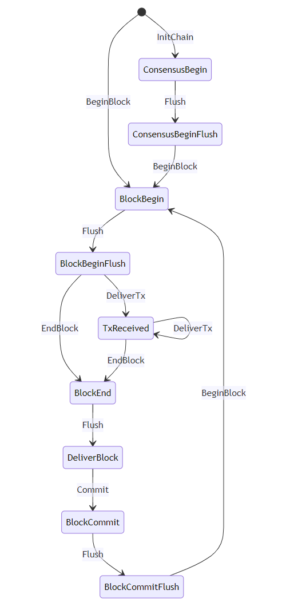

# async-abci

An ABCI like [tendermint-abci](https://crates.io/crates/tendermint-abci), but asynchronous.

## Version

- tendermint: 0.35.x
- spec: 0.7.1

## Packages

| name | description | crates.io | docs.rs |
| - | - | - | - |
| async-abci | use tendermint in Rust |  |  |
| tm-abci | ABCI interface in `no_std` |  |  |
| tm-protos | ABCI types in `no_std` |  |  |

## Features

- async-abci: async version of ABCI, fully cooperate with `Flush` in ABCI message.
- Async runtime support: tokio.

## Design

### Consensus

